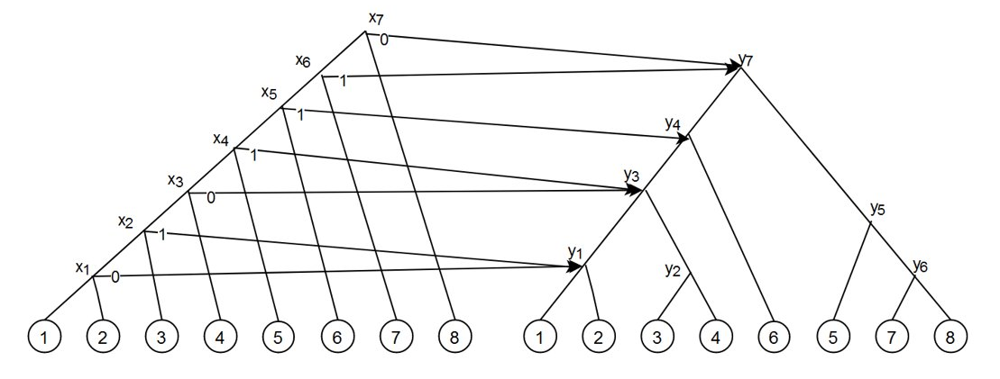
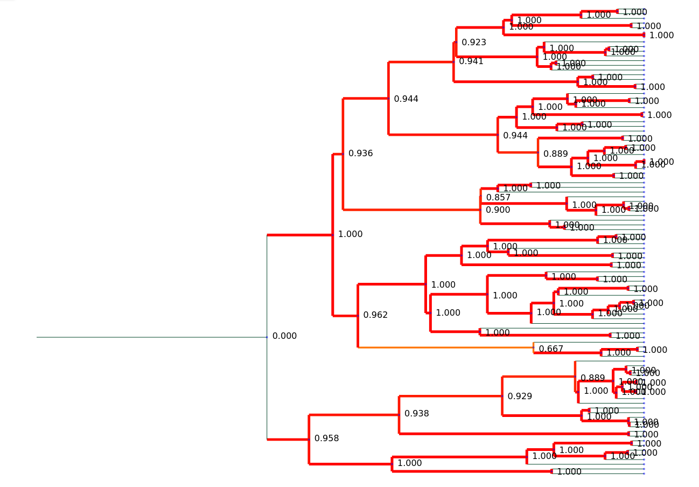

The Asymmetric Cluster Affinity cost is a phylogenetic cost quantifying the topological distance from a source tree to a target tree. It does so by finding the best possible match for each cluster in the source tree from all clusters in the target tree. 

If you use this software, please cite: Wagle, S., Markin, A., Górecki, P., Anderson, T. K., & Eulenstein, O. (2024). Asymmetric cluster-based measures for comparative phylogenetics. Journal of Computational Biology, 31(4), 312-327. doi:(https://doi.org/10.1089/cmb.2023.0338)

This software also uses ete4 for visualization. Hence, please also cite: Jaime Huerta-Cepas, François Serra and Peer Bork. "ETE 3: Reconstruction, analysis and visualization of phylogenomic data."  Mol Biol Evol (2016) doi: 10.1093/molbev/msw046

### Installation
Cluster Affinity is available in PyPi and can be installed as ``pip install cluster-affinity``. Note that the package is built for Python 3.10 or higher.

### Tutorial
---
For this tutorial, we will focus on visualizing the cluster affinity cost between the trees  and . Both trees are generated by the yule-harding model and contain 100 leaves each. 

The following command computes the cluster affinity cost from source tree t1 to target tree t2 and returns the normalized cluster affinity cost. The cost is normalized on a scale of 0-1 where 0 is a tree identical to t1 and 1 is the maximum cluster affinity cost attainable by t1

``
cluster_affinity examples/t1.tre examples/t2.tre 
``

The command also opens up an interactive web session (by default at localhost:5000) to visualize the source and target trees. The source tree has node labels representing the cluster affinity cost for that node (normalized to 0-1 as well), with branches colored by the cluster affinity cost as well. An example of source tree visualization is given below:

To compute the cluster support cost instead, ``cluster_affinity`` can be replaced with ``cluster_support`` in all commands. For example:
``
cluster_support t1.tre t2.tre
``
computes the cluster support cost from t1 to t2 and opens up an interactive browser session for the same. 

If the command is used as part of a automation script, the cli flag can be used instead to prevent the interactive session from running.

``
cluster_affinity t1.tre t2.tre --cli
``

Further options can be accessed using ``cluster_affinity -h`` 
